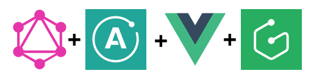

# Vue-Graphcool-Blog

Sample project that shows how to build a Blog App with VueJS, GraphQL, Apollo Client and Graphcool.

This example is based on the example ["Build a Blog with VueJS, GraphQL and Apollo Client"](https://scotch.io/tutorials/build-a-blog-with-vue-graphql-and-apollo-client) that I modified to practice my skills. The original post uses GraphQL server built with AdonisJS and it also uses Bulma CSS. I have decided to replace "GraphQL server built with AdonisJS and Bulma CSS" with Graphcool and Vuetify. This project integrates Typescript in VueJS.

Technologies: Vue.js, Vuetify.js, Vuex, Typescript, GraphQL, Apollo Client and Graphcool.



## Build Setup

Before you go through this example, you should have at least a basic understanding of Vue concepts. You must also already have Vue Cli installed on your machine.

``` bash
# Install dependencies.
npm install

# Serve with hot reload at localhost:8080
npm run dev

# Build for production with minification
npm run build
```

For detailed explanation on how things work, consult the [docs for vue-loader](http://vuejs.github.io/vue-loader).

## Requirements

* [Node.js](http://nodejs.org/)
* [Vue cli](https://github.com/vuejs/vue-cli)

## License
   
The MIT License (MIT) Copyright (c)

Permission is hereby granted, free of charge, to any person obtaining a copy of this software and associated documentation files (the "Software"), to deal in the Software without restriction, including without limitation the rights to use, copy, modify, merge, publish, distribute, sublicense, and/or sell copies of the Software, and to permit persons to whom the Software is furnished to do so, subject to the following conditions:

The above copyright notice and this permission notice shall be included in all copies or substantial portions of the Software.

THE SOFTWARE IS PROVIDED "AS IS", WITHOUT WARRANTY OF ANY KIND, EXPRESS OR IMPLIED, INCLUDING BUT NOT LIMITED TO THE WARRANTIES OF MERCHANTABILITY, FITNESS FOR A PARTICULAR PURPOSE AND NONINFRINGEMENT. IN NO EVENT SHALL THE AUTHORS OR COPYRIGHT HOLDERS BE LIABLE FOR ANY CLAIM, DAMAGES OR OTHER LIABILITY, WHETHER IN AN ACTION OF CONTRACT, TORT OR OTHERWISE, ARISING FROM, OUT OF OR IN CONNECTION WITH THE SOFTWARE OR THE USE OR OTHER DEALINGS IN THE SOFTWARE.
   
Original work Copyright (c) 2018 Adrián Brito